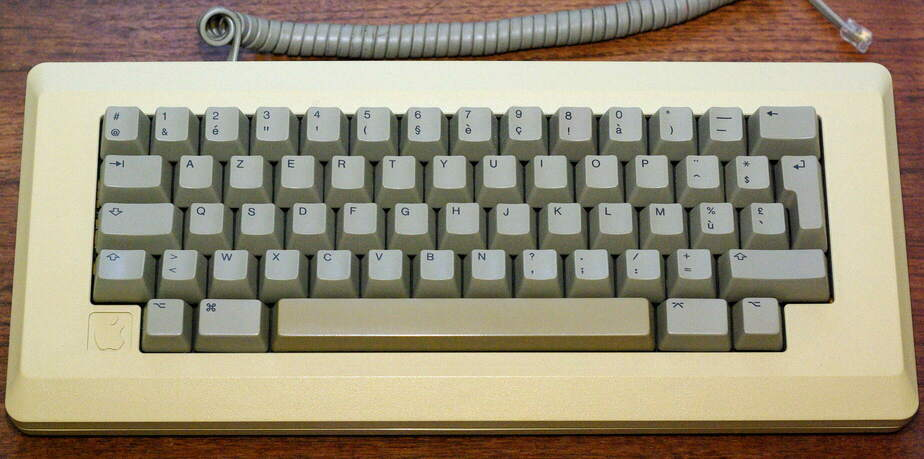

# PS2 keyboard to Macintosh Plus keyboard interface

This program is the interface code for AVR with a PS2 keyboard. It implements a PS2 keyboard interface and a Mac Plus serial keyboard interface. The code configures the keyboard, accepts scan codes, converts the AT scan codes to make/break codes for the Mac.

## Resources

- [Implementation sample](http://www.synack.net/~bbraun/mackbd/index.html)
- [Mac Linux M68000](http://www.mac.linux-m68k.org/devel/plushw.php)
- [BMOW](https://www.bigmessowires.com/2011/08/28/plus-too-keyboard-and-mouse/)
- [PS2 protocol](http://www.burtonsys.com/ps2_chapweske.htm)
- [PS2 keyboard command protocol](https://wiki.osdev.org/PS/2_Keyboard)
- [Scan codes and layout](https://github.com/altercation/tmk_firrmware_hhkb_teensy2/blob/master/protocol/m0110.c)

## Mac Plus interface

### Connectivity

```
 +-----+            +-----+            +----------+
 |     |            |     |            |          |
 |     |            |     |            |          |
 |     |            |     |            |          |
 |     +--< Data >--+     +--< Data >--+ PS2      |
 | Mac |            | AVR |            | keyboard | 
 |     +--< CLK ]---+     +--< CLK ]---+          |
 |     |            |     |            |          |
 |     |            |     |            |          |
 |     |            |     |            |          |
 +-----+            +-----+            +----------+
 
 Mac Plus RJ9 4P4C connecotr
 pin 1 - black  - GND
 pin 2 - red    - Clock
 pin 3 - green  - Data
 pin 5 - yellow - +5v
 
```

### ATtiny85 AVR IO

 | Function  | AVR  | Pin | I/O                |
 |-----------|------|-----|--------------------|
 | Reset     | PB5  | 1   | Pull up            |
 | PS2 clock | PB3  | 2   | in/out             |
 | PS2 data  | PB4  | 3   | in/out             |
 | KBD Clock | PB0  | 5   | Mac keyboard clock |
 | KBD data  | PB1  | 6   | Mac keyboard data  |
 | TP1       | PB2  | 7   | Test point         |

## Scan code processing

- Only pass make and break codes for keys in range 1 to 58 and 91 (make code 0xE0 0x5B) that is the Mac Command key.
- Use translation table to convert from PS2 keyboard to Mac keyboard code.
- add 'make' and 'break' bit 7 in keyboard code for key-down and key-up signaling.

## Apple M0110 keyboard



```

Keyboard codes in hexadecimal:

    ,---------------------------------------------------------.
    | 65| 25| 27| 29| 2B| 2F| 2D| 35| 39| 33| 3B| 37| 31|   67|
    |---------------------------------------------------------|
    |   61| 19| 1B| 1D| 1F| 23| 21| 41| 45| 3F| 47| 43| 3D|   |
    |-----------------------------------------------------'   |
    |    73| 01| 03| 05| 07| 0B| 09| 4D| 51| 4B| 53| 4F|    49|
    |---------------------------------------------------------'
    |      71| 0D| 0F| 11| 13| 17| 5B| 5D| 57| 5F| 59|   71   |
    `---------------------------------------------------------'
       |   75|     6F|            63             | 69 | 75 |
       `---------------------------------------------------'
    
```
